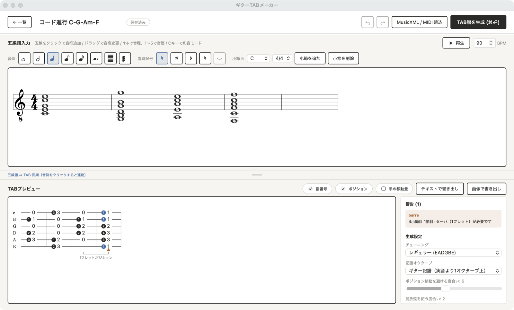

# ギターTAB譜メーカー

五線譜で入力した単音旋律・和音を、運指を最適化したギターTAB譜に変換するアプリケーション。
設計は [docs/design.md](docs/design.md) を参照。

**[⬇ ダウンロードはこちら（macOS / Windows）](../../releases/tag/latest)** — インストール不要、解凍してすぐ使えます。



## 特徴

- **五線譜エディタ** — クリックで音符入力、ドラッグで音高変更、臨時記号・付点・タイ・調号・拍子記号に対応
- **鍵盤入力** — 画面上の仮想ピアノ鍵盤、またはPCキーボード（A〜' が白鍵、W〜Pが黒鍵）で音を入力。弾くたびに続きへ挿入されるステップ入力方式で、和音モードと組み合わせれば和音も入力できる
- **運指最適化** — ビームサーチでポジション移動を最小化した運指を選ぶ
- **和音対応** — 同時に鳴る音を別々の弦へ割り当て、指が足りなければセーハを選ぶ（C・G・Am・F など標準的なコードは教科書どおりの押さえ方になる）
- **開放弦の扱い** — 開放弦は手のポジションに依存しないため、ポジション移動のコスト計算から除外する
- **手の移動速度の考慮** — 短い音価の間は5フレットまでしか手を動かせないものとして扱い、無理な運指を避ける
- **プロジェクト保存** — 音符・設定・生成結果をプロジェクト単位で保存し、自動保存で編集を再開できる
- **TABプレビュー** — 指番号・ポジション・手の移動量の重ね表示、五線譜とのハイライト同期、テキスト/画像書き出し
- **再生** — ブラウザ内で撥弦音を合成して試聴。再生位置を五線譜とTAB譜の両方でハイライトする

## セットアップ

```bash
# バックエンド
python3 -m venv .venv
.venv/bin/pip install -r requirements.txt

# フロントエンド
cd frontend && npm install && npm run build && cd ..
```

## 起動

```bash
./scripts/run.sh
```

http://127.0.0.1:8000 を開く。

フロントエンドを編集しながら開発する場合は、2つのプロセスを起動する。

```bash
.venv/bin/python -m uvicorn app.main:app --reload    # http://127.0.0.1:8000
cd frontend && npm run dev                           # http://localhost:5173
```

## テスト

```bash
.venv/bin/python -m pytest tests/ -q
```

## スタンドアロンアプリ（macOS / Windows）

サーバーを立てず、ダブルクリックで起動するネイティブアプリとして使うこともできる。データはブラウザ版と同様にローカルのJSONファイルに保存され、外部通信は行わない。

### ビルド済みアプリをダウンロードする（一番簡単）

[Releases](../../releases) に、常に最新のビルド（`latest` タグ、mainブランチへのpushのたびに自動更新）が置かれている。ダウンロードして解凍するだけで、Python や Node をインストールせずに使える。バージョンタグ（`v1.0.0` など）を切ったときは、そのバージョン専用のリリースも別途作成される。

- macOS: `GuitarTabMaker-macOS.zip` を解凍し、`GuitarTabMaker.app` を `/Applications` にコピー
- Windows: `GuitarTabMaker-Windows.zip` を解凍し、フォルダごと好きな場所に置いて `GuitarTabMaker.exe` を実行

ビルドログだけを見たい場合は [Actions](../../actions/workflows/build-app.yml) を参照（各pushごとのArtifactも30日間保持される）。

### 自分でビルドする

このリポジトリを clone した直後の状態から、以下の1コマンドで venv 作成・依存インストール・ビルドまで完結する。

```bash
# macOS / Linux
./scripts/build_app.sh
open dist/GuitarTabMaker.app
```

```powershell
# Windows (PowerShell)
.\scripts\build_app.ps1
.\dist\GuitarTabMaker\GuitarTabMaker.exe
```

- 保存先はOSごとの標準的なアプリデータ置き場（`~/Library/Application Support/GuitarTabMaker/projects/`、`%APPDATA%\GuitarTabMaker\projects\`、`~/.local/share/GuitarTabMaker/projects/`）で、インストール場所やビルドし直しに影響されない
- pywebview（ネイティブウィンドウ）+ 内部でFastAPIサーバーをバックグラウンド起動する構成。ブラウザは使わない
- CI（[.github/workflows/build-app.yml](.github/workflows/build-app.yml)）は push のたびに両OSでビルドし、`v*` タグを push するとGitHub Releaseにも自動で添付される

## 操作

| 操作 | 内容 |
| --- | --- |
| 五線をクリック | その音高で音符を追加 |
| 音符をクリック | 選択（Shift+クリックで複数選択） |
| 音符をドラッグ | 音高を変更 |
| ↑ / ↓ | 選択音を1音ずつ移動（Shift+↑↓でオクターブ） |
| ← / → | 選択を前後の音符へ移動 |
| 1〜5 | 音価を切り替え（全音符〜16分音符） |
| R / S / F / N / . / T | 休符 / ♯ / ♭ / ♮ / 付点 / タイ |
| C | 和音モード（クリックでその位置の音に重ねる。Alt+クリックでも可） |
| ⌘Z / ⇧⌘Z | 元に戻す / やり直す |
| ⌘C / ⌘V | コピー / ペースト |
| Space | 再生 / 停止（音符を選択していればその位置から） |
| ⌘Enter | TAB譜を生成 |

### 鍵盤入力モード中のキー

鍵盤入力モードをONにすると、以下のキーは音符入力に切り替わる（休符・♯・♭・♮・タイの単独キーは一時的に使えなくなる。ツールバーのボタンからは引き続き操作できる）。

| キー | 内容 |
| --- | --- |
| A S D F G H J K L ; ' | 白鍵（1オクターブ＋完全4度ぶん） |
| W E &nbsp;&nbsp; T Y U &nbsp;&nbsp; O P | 黒鍵（♯として入力される） |
| Z / X | 表示オクターブを1つ下げる / 上げる |

弾いた音は、選択中の音符の直後に追加され、選択が自動的に進む（ステップ入力）。和音モードと組み合わせると、選択中の音に重ねて和音になる。

## 書き出しについて

TAB譜の書き出しは、ウィンドウサイズに依存しない。画像は常に固定幅1080px・2倍解像度でレイアウトし直してから
PNG化するため、画面を広げても狭めても同じ小節割り・同じ寸法の画像になる。テキストは1行4小節で出力する。

## 記譜オクターブについて

ギター譜は慣例として実音より1オクターブ高く記譜する。本アプリも五線譜は**ギター記譜**（ト音記号 8vb）で扱い、
TAB譜は実音を表示する。実音そのままで扱いたい場合は、生成設定の「記譜オクターブ」を「実音どおり」に変更する。
MIDIは実音のため、読み込み時に1オクターブ上げて五線譜に配置する。

## 構成

```
app/
  domain/      Note / MeasureInfo / Candidate / State / Tuning   （設計書 6章）
  optimizer/   スコアリングとビームサーチによる運指最適化          （設計書 7・8章）
  renderer/    TAB譜テキストレンダリング                          （設計書 5.2）
  parser/      MusicXML / MIDI パーサー（music21）                （設計書 11章）
  repository/  プロジェクトのJSON永続化                           （設計書 17.7）
  api/         /api/convert・/api/import・/api/projects           （設計書 12.3・17.7.3）
  desktop.py   スタンドアロンアプリのエントリポイント（pywebview）
frontend/src/
  music/       音高・スコアモデル
  components/  プロジェクト一覧 / 五線譜エディタ / TABプレビュー   （設計書 17.2）
data/projects/ 保存されたプロジェクト（TAB_MAKER_DATA_DIR で変更可）
```
